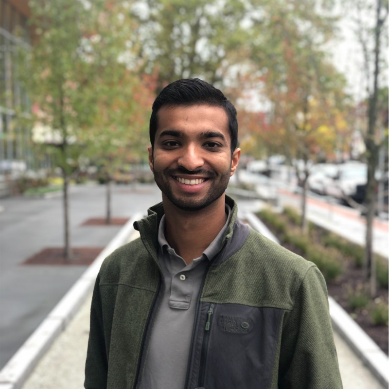

## About Me

Hi! I am a recent graduate of Harvard University, where I earned a joint BA/MS in Computer Science. I graduated magna cum lauda with highest honors, and was inducted in Phi Beta Kappa. In my final two years, I worked with Alexander Rush in the Harvard NLP Group on deep learning over sequential data. 

For my thesis, I used Dilated Convolutional Neural Networks to improve regulatory marker predictive accuracy on a whole-genome labeling task. This work was accepted to the ICML 2017 Workshop in Computational Biology, where I was also invited to give a talk, and received a speaker award and best poster award.

## Research Interest

I'm primarily interested in developing widely-applicable machine learning models. My existing research experiences have spanned a variety of machine learning domains, including bayesian inference and deep learning. I'm particularly interested in problem domains that pose unique data constraints. For examples, genomics datasets tend to be much sparser and have longer-distance dependencies than comparable sequential datasets in natural language processing. I'm interested in understanding how these unique constraints limit the efficacy of existing models, and in building models that are robust to them.

## Publications

1. Gupta, A. and Rush, A.M., 2017. Dilated Convolutions for Modeling Long-Distance Genomic Dependencies. International Conference of Machine Learning, Sydney, Australia. [[arXiv]](https://arxiv.org/abs/1710.01278) [[code]](https://github.com/harvardnlp/regulatory-prediction)

## Awards

1. Speaker Award, ICML 2017, Workshop on Computational Biology
2. Best Poster Award, ICML 2017, Workshop on Computational Biology
3. Phi Beta Kappa Honor Society Inductee, Harvard College, May 2017

## Teaching 

While I was a student at Harvard, I had the opportunity to be a teaching fellow for a variety of courses. This role involved helping write problem sets, teaching sections, holding office hours, leading course-wide review sessions, and grading.

Year | Course 
-----|-------
2017 | CS 181: Machine Learning  
2016 | CS 182: Artificial Intelligence
2016 | CS 181: Machine Learning
2014 | CS 50: Introduction to Computer Science

## References

* Alexander "Sasha" Rush: Assistant Professor of Computer Science, Harvard University.
* David Parkes: Area Dean for Computer Science, George F. Colony Professor of Computer Science, Harvard University.
* Finale Doshi-Velez: Assistant Professor of Computer Science, Harvard University

## Website
This is a jekyll based resume template. You can find the full source code on [GitHub](https://github.com/bk2dcradle/researcher)

